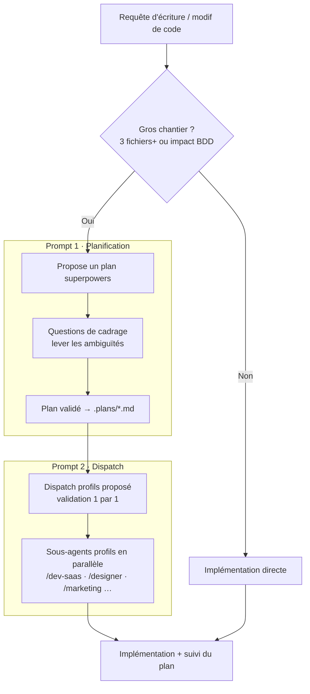

# claude-profiles

**Dépôt : https://github.com/10erue/claude-profiles**

Collection de **profils métier packagés pour Claude Code**. Chaque profil est un plugin Claude Code (`.plugin`) qui regroupe, autour d'un métier, un ensemble cohérent de *skills* tierces, un sous-agent dédié et une commande slash pour l'invoquer.

L'idée : au lieu d'installer et de configurer skill par skill, on charge un pack orienté métier (`dev-saas`, `designer`, `marketing`…) qui apporte d'un coup toutes les compétences pertinentes et un agent spécialisé qui sait les utiliser.

## Contenu du dépôt

```
claude-profiles/
├── profil-starter.plugin           # profil générique / base neutre
├── profil-dev-saas.plugin          # développement SaaS, n8n, code review
├── profil-designer.plugin          # design UI/UX, Stitch, design systems
├── profil-knowledge-worker.plugin  # gestion de connaissances, Obsidian, wiki
├── profil-manager-ops.plugin       # pilotage, orchestration, ops (Octopus, Plannotator)
├── profil-marketing.plugin         # marketing, SEO, growth, contenu (~180 skills)
├── profil-migrator-lovable.plugin  # agent de migration : Lovable → paradigme END
└── profil-video.plugin             # production et analyse vidéo
```

Chaque fichier `.plugin` est en réalité une **archive ZIP** (inspectable avec `unzip -l fichier.plugin`).

## Anatomie d'un profil

Tous les plugins suivent la même structure interne :

```
profil-<nom>.plugin (zip)
├── .claude-plugin/plugin.json   # manifeste : name, version, description, author
├── README.md                    # skills incluses + actions manuelles à faire
├── agents/<nom>.md              # définition du sous-agent dédié
├── commands/<nom>.md            # commande slash /<nom>
├── standards/doctrine.md        # doctrine de travail du profil (starter surtout)
├── skills/<skill>/SKILL.md      # les skills embarquées (0 à ~180 selon le profil)
└── .mcp.json                    # serveurs MCP à démarrer (si le profil en fournit)
```

Trois briques constituent un profil :

1. **Le sous-agent** (`agents/<nom>.md`) — un agent Claude Code avec sa propre doctrine, invoqué dans son propre contexte.
2. **La commande** (`/<nom> <tâche>`) — déclenche le sous-agent sur la tâche décrite.
3. **Les skills** — compétences activées automatiquement quand le plugin est installé et activé.

## Fonctionnement : comment on s'en sert

### Installer / activer un profil
Les `.plugin` sont des plugins Claude Code. On les installe/active via le panneau de plugins (`/plugin`). Une fois activé, un profil :
- rend ses **skills disponibles** automatiquement (activables/désactivables individuellement dans le panneau) ;
- ajoute sa **commande** `/<nom>` ;
- démarre ses **serveurs MCP** s'il en déclare (voir `.mcp.json`).

### Lancer un profil sur une tâche
```
/dev-saas Corrige le bug d'auth dans le middleware
/designer Propose une refonte de la landing
/marketing Écris une séquence d'emails de lancement
```
La commande lance le **sous-agent dédié**, qui traite la tâche de façon autonome, dans son propre contexte, depuis l'angle d'expertise du profil, puis rapporte un résumé.

### Faire travailler plusieurs profils en parallèle
Point clé du système : plusieurs profils peuvent être lancés **sur la même tâche**, chacun dans son contexte, pour comparer les angles :
```
/dev-saas et /marketing : que pensez-vous de cette page de pricing ?
```
Chaque sous-agent travaille indépendamment et remonte son analyse.

### Actions manuelles
Certaines dépendances **ne peuvent pas** être embarquées dans le plugin (installations globales, autres plugins de marketplace, serveurs MCP nécessitant une clé API). Le `README.md` de chaque profil liste ces **« actions manuelles à faire »** — à réaliser soi-même. Exemples : `frontend-design`, `superpowers`, `claude-mem`, `n8n-mcp`, `magic-mcp`, `caveman`, `ecc`.

Chaque profil ajoute aussi une commande **`/init`** (`/profil-<nom>:init` en cas de collision entre profils installés en parallèle) : elle vérifie l'état de ces prérequis un par un et, pour ceux qui le permettent (la plupart — installs de plugins/CLI/SDK sans secret requis), propose de les installer directement, avec confirmation explicite avant toute action. Seuls les prérequis nécessitant une clé API, une info propre à ton infra, ou un fichier personnel restent strictement manuels.

## Les profils

| Profil | Commande | Périmètre | Skills embarquées |
|--------|----------|-----------|-------------------|
| **starter** | `/starter` | Base neutre, générique. Amorce puis route vers un profil spécialisé | 0 (que du manuel) |
| **dev-saas** | `/dev-saas` | Dev SaaS, workflows n8n, code review, refactor, debug | ~25 (n8n-*, review-*, cavecrew, caveman-stats ; caveman en prérequis) |
| **designer** | `/designer` | UI/UX, Stitch, design systems, génération de composants | ~72 (stitch-*, taste, ui-ux-pro-max) |
| **knowledge-worker** | `/knowledge-worker` | Gestion de connaissances, Obsidian, wiki, second brain | ~17 (wiki-*, obsidian-*, think) |
| **manager-ops** | `/manager-ops` | Pilotage, orchestration multi-agents, ops, PRD | ~78 (Octopus flow-*/skill-*, Plannotator) |
| **marketing** | `/marketing` | Marketing, SEO, growth, contenu, ads, email | ~180 (seo-*, blog-*, ads, growth) |
| **migrator-lovable** | `/migrator-lovable` | Agent de migration (famille) — Lovable → paradigme END | 12 (pipeline complet, voir section dédiée) |
| **video** | `/video` | Production et analyse vidéo, clips YouTube | 4 (claude-video, video-perception…) |

Les skills sont **agrégées depuis ~15-20 dépôts GitHub tiers** (stitch-kit, claude-octopus, ai-marketing-skills, plannotator, n8n-skills, etc.), puis repackagées par profil. Chaque `README.md` de plugin liste la **source GitHub** de chaque skill.

## Agents de migration

Les **agents de migration** forment une **famille de profils à part** : ce ne sont pas des packs de skills tierces, mais des **agents spécialisés conçus sur mesure** pour migrer un codebase existant d'une **techno source** donnée vers un **paradigme cible**. Chaque agent de la famille cible une techno source précise (`migrator-<source>`) et partage la même mécanique : init + cartographie graphify, pipeline en ordre strict (diagnostic → correspondance → migration écran par écran → gates verts → audit), artefacts dans `<target>/.plans/migration/`.

| Agent | Techno source | Statut |
|-------|---------------|--------|
| **`migrator-lovable`** | Prototype Lovable (React mocké) | ✅ Disponible |
| `migrator-symfony` | Application Symfony | 🔜 À venir |
| `migrator-laravel` | Application Laravel | 🔜 À venir |

> La liste s'étoffera au fil des besoins. Chaque nouvel agent suit le même squelette que `migrator-lovable` — seuls la techno source analysée et la table de correspondance changent.

### `migrator-lovable` (disponible)

Migre un **prototype Lovable** (React mocké, structure plate) vers le **paradigme cible « station END »** — architecture feature-based, TanStack Router (file-routes), façade `apiClient` mockée, i18n END (react-i18next), primitives shadcn/ui + `cn()`.

Objectif d'une migration : un front **fonctionnel, testé (Vitest) et vérifié** (typecheck + lint + build verts). Les données restent **mockées** derrière une façade à la signature des hooks API générés (Orval + TanStack Query), pour brancher la vraie API plus tard sans refacto.

#### Les agents en jeu

| Agent | Contexte d'exécution | Rôle |
|-------|----------------------|------|
| **Boucle principale** (`/profil-migrator-lovable:init`) | Session Claude Code | Amorçage : archive la source en `.legacy/`, prépare `.plans/migration/`, `.gitignore`, `pnpm install` + baseline (`tsc --noEmit` + `build`) |
| **2 sous-agents graphify** | Spawnés par l'init, en parallèle | Cartographient les 2 codebases (proto source et repo cible) en graphes de connaissance |
| **Sous-agent `migrator-lovable`** (`/migrator-lovable`) | Son propre contexte, autonome | Orchestre le pipeline de migration complet, du diagnostic à l'audit final |

#### Le pipeline (ordre strict)

1. `analyze-source` → inventaire du proto (`SOURCE_INVENTORY.md`)
2. `extract-target-paradigm` → paradigme END résolu contre le repo cible réel
3. `build-correspondence-map` → table de correspondance start→end + cas non mappables
4. `migrate-assets` → icônes/images/SVG vers les conventions END (lucide-react, `public/`)
5. `extract-shadcn-variables` → référentiel du design system END (design 1/3)
6. `migrate-css-to-bridge` → CSS custom du proto dans `src/styles/bridge/` (design 2/3)
7. `apply-shadcn-variables` → alignement du bridge sur les tokens `@seekube/brand` (design 3/3)
8. `scaffold-app-shell` → pose du socle d'app END (router, i18n, apiClient…), vert avant l'écran 1
9. `migrate-screen` → migration d'UN écran walking-skeleton, test unitaire d'abord
10. `verify-migration` → gates verts obligatoires (typecheck, lint, build, Vitest) avant de généraliser
11. Généralisation écran par écran (`migrate-screen` → `verify-migration`)
12. `audit-conformity` → audit final, note /100 + plan d'action priorisé

Tous les artefacts du pipeline vivent dans `<target>/.plans/migration/`.

📄 **Détail complet de chaque agent et de son fonctionnement : [docs/migration-agents.html](docs/migration-agents.html)**

## Doctrine commune

Tous les profils héritent d'un **socle commun** (défini dans `standards/doctrine.md` du starter) :
- Lire l'`AGENTS.md` le plus proche avant d'agir.
- Aucune commande destructive sans confirmation explicite.
- Diffs et actions minimaux ; poser une question si l'intention est ambiguë.
- **Intégration theTribe Studio** : si un Studio est détecté (`.claude/standards/` dans le repo), il est la source de vérité — les agents Studio *cadrent/analysent*, les profils *exécutent* ; ne rien écrire dans `projet/`, `backlog/`, `sources/`.
- Jamais d'appel Agent imbriqué : le profil est déjà un sous-agent, il travaille en autonomie.

## Le workflow à suivre

De la requête à l'implémentation : planifier les gros chantiers, faire valider le plan, puis répartir le travail entre les agents profils.



> **💡 Conseil — Graphify.** Avant de planifier, utilisez [Graphify](https://github.com/safishamsi/graphify) pour cartographier la base de code (graphe de connaissance : dépendances, relations entre fichiers, communautés). Claude s'appuie sur ce graphe au lieu de relire tout le code à chaque question : plus **rapide**, et surtout **beaucoup moins de tokens consommés**. Particulièrement utile pour affiner l'évaluation « gros chantier ? » et cadrer le plan.

## Prompts conseillés

Pour tirer le meilleur parti des profils, deux prompts sont recommandés dans votre `CLAUDE.md` (global ou projet). Le premier déclenche une phase de planification avant les gros chantiers ; le second, une fois le plan validé, propose de répartir le travail entre les sous-agents profils.

### 1. Planification avant code (superpowers)

```markdown
## Planification avant code (superpowers)

Dès la première requête d'une session portant sur l'écriture ou la modification
de code, évalue si la tâche constitue un gros chantier selon ces critères :
- modification prévue sur **3 fichiers ou plus**, OU
- **changement impactant la base de données** (schéma, migration, modèle de données).

Utilise Graphify si besoin pour cartographier rapidement le code concerné et
affiner cette estimation.

- **Si un des critères est rempli** : demande-moi si je souhaite établir
  un plan avec superpowers avant de commencer.
  - Si je réponds oui : avant de rédiger le plan, pose-moi les questions
    nécessaires pour lever les ambiguïtés (choix techniques, périmètre,
    contraintes, priorités) via une question à l'utilisateur. Une fois les
    réponses obtenues, établis le plan avec superpowers, présente-le-moi,
    et attends ma validation avant de commencer l'implémentation.
  - Si je réponds non : procède directement à l'implémentation.
- **Si aucun critère n'est rempli** : procède directement, sans poser la question.
- Cette évaluation et cette question (le cas échéant) n'interviennent qu'une
  seule fois par session, au tout début — pas à chaque nouvelle requête de
  code dans la même session.

### Nommage du fichier de plan
Le fichier de plan doit être nommé explicitement selon la tâche :
- S'il est lié à un ticket : `.plans/TICKET-123-nom-explicite.md`
  (ex: `.plans/JIRA-456-refonte-auth.md`)
- Sinon : `.plans/nom-explicite-de-la-tache.md` (ex: `.plans/migration-schema-users.md`)

### Suivi du plan
Une fois le plan validé, mets-le à jour au fur et à mesure de l'avancement
jusqu'à réalisation complète de la tâche. Pas besoin d'afficher le plan en
entier à chaque mise à jour : indique simplement une phrase du type :

> Plan mis à jour, consultable ici : `.plans/TICKET-123-nom-explicite.md`
```

### 2. Dispatch de sous-agents profils après plan superpowers

```markdown
## Dispatch de sous-agents profils après plan superpowers

Une fois qu'un plan superpowers est établi ET validé par moi, avant de lancer
l'implémentation :

1. **Analyse le plan** et découpe-le en tâches assignables.
2. **Propose un dispatch** de sous-agents parmi les profils disponibles
   (plugins `profil-[profil]` : designer, dev-saas, knowledge-worker,
   manager-ops, marketing, starter, video). Pour chaque sous-agent proposé,
   présente :
   - le profil choisi (`profil-[profil]`),
   - la tâche précise qui lui est assignée,
   - pourquoi ce profil est le bon pour cette tâche.
3. Présente l'ensemble sous forme de liste numérotée, par exemple :

   > Dispatch proposé :
   > 1. `profil-dev-saas` → implémenter l'endpoint API `/users` (backend + tests)
   > 2. `profil-designer` → maquetter le formulaire d'inscription
   > 3. `profil-marketing` → rédiger les textes de la landing

4. **Confirmation obligatoire, une par une** : ne lance JAMAIS un sous-agent
   sans mon accord explicite pour celui-ci. Demande la validation de chaque
   dispatch individuellement avant son lancement. Je peux en accepter certains,
   en refuser, en modifier, ou changer le profil assigné.
5. Une fois un dispatch confirmé, lance le sous-agent correspondant via l'agent
   `profil-[profil]:[profil]` avec la tâche assignée. Les sous-agents dont le
   travail est indépendant peuvent tourner en parallèle.

Ce mécanisme ne s'applique qu'après un plan superpowers validé, jamais
sans plan préalable.
```

## Qualité & maintenance

Les plugins ont fait l'objet d'un **audit qualité** : correction de skills non chargeables (frontmatter cassé), suppression de préambules de télémétrie parasites, normalisation des noms en kebab-case, résolution de collisions de noms. Résultat : **378/378 skills parsent correctement**, 0 skill morte, 0 collision (383 au total avant le retrait des 5 skills caveman dupliquées de dev-saas — voir `autonomous/` pour la version non-dédupliquée).

Les doublons de skills entre profils (ex. `autoresearch`, `ui-ux-pro-max`) sont **intentionnels** : chaque profil embarque sa propre variante, namespacée par plugin — aucun conflit.

## Inspecter un plugin

```bash
# Lister le contenu d'un profil
unzip -l profil-dev-saas.plugin

# Lire le manifeste
unzip -p profil-dev-saas.plugin .claude-plugin/plugin.json

# Lire le README (skills + actions manuelles)
unzip -p profil-dev-saas.plugin README.md

# Lire une skill précise
unzip -p profil-dev-saas.plugin skills/caveman/SKILL.md
```
